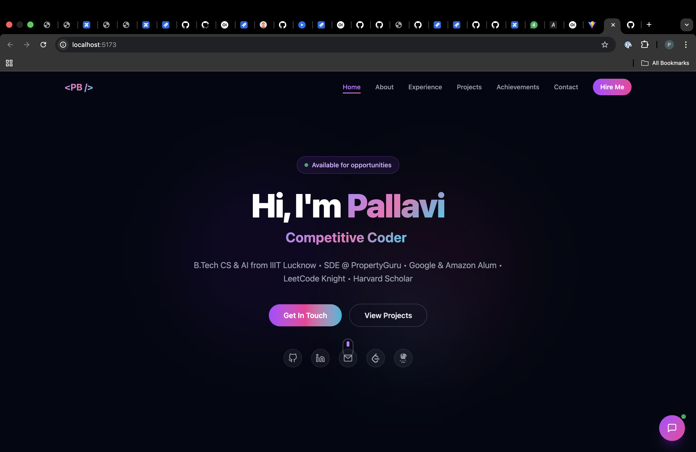

# 🚀 AI-Powered Portfolio

  
  
  

    <strong>A modern, AI-powered portfolio showcasing my journey as a Software Engineer</strong>
  

  
  

    <a href="#">🌐 Live Demo (coming soon)</a> •
    <a href="#features">✨ Features</a> •
    <a href="#tech-stack">🛠️ Tech Stack</a> •
    <a href="#getting-started">🚀 Getting Started</a>
  

---

## 👩‍💻 About Me

Hi! I'm _Pallavi Bahekar, a Software Development Engineer with experience at **PropertyGuru, **Google, and \*\*Amazon_. This portfolio showcases my work, skills, and the AI-powered projects I've built.

- 🎓 B.Tech CS & AI from IIIT Lucknow
- 💼 Currently SDE @ PropertyGuru
- 🏆 LeetCode Knight | Harvard Scholar | 300+ DSA problems solved
- 🤖 Passionate about AI/ML, NLP, and building intelligent applications

---

## ✨ Features

### 🤖 _AI-Powered Chatbot_

- _TF-IDF-based NLP Engine_ — Real semantic understanding of queries
- _Confidence Scoring_ — Every response shows confidence percentage
- _Live Sentiment Analyzer_ — Try real-time sentiment analysis in the demo tab
- Suggests intelligent follow-up questions

### 📱 _Project Showcases_

- _Interactive AI Walkthrough_ — See actual code snippets from projects
- _Syntax-Highlighted Code Viewer_ — VS Code dark theme
- _Real Screenshots_ — Carousel previews of Timewise app & portfolio
- Detailed feature breakdowns & tech stack badges

### 🎨 _Modern UI/UX_

- _Framer Motion Animations_ — Smooth scroll-triggered animations
- _Glassmorphism Design_ — Card-glass effects with backdrop blur
- _Gradient Accents_ — Purple/pink/cyan theme throughout
- _Fully Responsive_ — Mobile, tablet, desktop optimized

### 📊 _Professional Sections_

- _Hero_ — Animated typewriter cycling through roles
- _About_ — Education timeline + 5 skill categories
- _Experience_ — Google, Amazon, PropertyGuru with tech badges
- _Projects_ — Timewise (Flutter+ML+NLP) + AI Portfolio
- _Achievements_ — 10 key milestones + coding profiles
- _Contact_ — Email, LinkedIn, GitHub, LeetCode, CodeChef

---

## 🛠️ Tech Stack

### _Frontend_

### _Libraries_

- _Framer Motion_ — Animation library
- _React Icons_ — Icon sets (Feather + Simple Icons)
- _React Syntax Highlighter_ — Code snippet rendering with Prism

### _AI/NLP_

- _Custom TF-IDF Engine_ — Built from scratch in vanilla JS
- _Tokenization & Stop-word Filtering_ — Text preprocessing
- _Sentiment Analysis_ — Positive/negative word scoring
- _Partial Match Algorithm_ — Handles incomplete queries

---

## 🚀 Getting Started

### Prerequisites

- Node.js 18+
- npm or yarn

### Installation

bash

# Clone the repository

git clone https://github.com/pallaviBahekar-pg/portfolio.git

# Navigate to project directory

cd portfolio

# Install dependencies

npm install

# Start development server

npm run dev

The app will be running at http://localhost:5173

### Build for Production

bash
npm run build

---

## 📂 Project Structure

portfolio/
├── src/
│ ├── components/
│ │ ├── Navbar.jsx
│ │ ├── Hero.jsx
│ │ ├── About.jsx
│ │ ├── Experience.jsx
│ │ ├── Projects.jsx # AI walkthrough + image carousel
│ │ ├── Achievements.jsx
│ │ ├── Contact.jsx
│ │ ├── Chatbot.jsx # NLP engine + sentiment demo
│ │ └── Footer.jsx
│ ├── data/
│ │ └── portfolioData.js # Single source of truth
│ ├── hooks/
│ │ └── useInView.js # IntersectionObserver hook
│ ├── App.jsx
│ ├── index.css # Tailwind + custom utilities
│ └── main.jsx
├── public/
│ └── previews/
│ ├── timewise1.png # Timewise app screenshots
│ ├── timewise2.png
│ └── portfolio.png # Portfolio screenshot
└── README.md

---

## 🎯 Key Highlights

### _Timewise Application_

- Flutter mobile app with _ML + NLP_ integration
- Smart grocery shopping with sentiment analysis
- Real-time freshness predictions
- [View Project →](https://github.com/pallavibahekar/timewise)

### _AI-Powered Portfolio_ (This Project)

- React + Vite with custom NLP chatbot
- TF-IDF scoring for intelligent responses
- Syntax-highlighted code walkthroughs
- Live sentiment analyzer demo

---

## 📫 Connect With Me

_Email:_ lci2021041@iiitl.ac.in

---

## 📊 GitHub Stats

  

  

---

## 📝 License

This project is open source and available under the [MIT License](LICENSE).

---

  
Made with ❤️ by <strong>Pallavi Bahekar</strong>

  
⭐ Star this repo if you like it!

